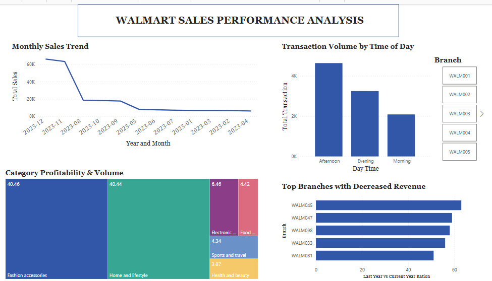

# Walmart Sales Data: End-to-End Analysis Pipeline

## Project Overview 


---

## Project Background:
In the competitive retail landscape, understanding the nuances of branch performance and consumer habits is vital for maintaining a market edge. This project establishes a robust, end-to-end data pipeline to analyze Walmart Sales Data.
By integrating Python for ETL (Extract, Transform, Load), MySQL for deep relational querying, and Power BI for visual storytelling, this pipeline transforms raw transactional records into actionable business intelligence. The primary objective is to solve operational bottlenecks regarding staffing, inventory allocation, and customer satisfaction.

Problem statement:
- Identify branches experiencing a decline in revenue and understand the growth ratio between fiscal years.

- Determine peak business hours and the busy days to optimize staffing levels and inventory management.

- Distinguish between high-value and low-value items and understand which categories dominate market share.

- Pinpoint low-rated transactions and identify the highest-rated categories to improve service delivery.
  
The SQL queries used to extract insights can be found [here](sql_queries)

## Data Structure & Initial Checks
The walmart database structure as seen below is a comprehensive single table consisting of 12 columns.


Prior to the analysis, a series of rigorous preprocessing checks were performed on the raw dataset using Python to address inconsistencies, handle missing values, and verify data types. The notebook with the data loading, exploration and cleaning steps can be found [here](project.ipynb)

## Executive Summary
Analysis of this multi-year dataset reveals a business environment characterized by high volume but significant fiscal volatility. By bypassing surface-level metrics, the study evaluates the operational health of the retail infrastructure, pinpointing specific areas of high performance and identifying critical threats to sustained growth.

**Core Strategic Findings**:
- **The Growth Gap**: While Weslaco, Waxahachie, and Plano serve as the primary drivers of revenue, the distribution network faces a critical growth challenge across 42 underperforming branches. Financial data from 2023 reveals a distinct revenue retreat compared to the previous year, with the most pronounced declines occurring in Missouri City (WALM045), Flower Mound (WALM047), Mineral Wells (WALM098), Pearland (WALM033) and Friendswood (WALM081). These trends suggest a loss of competitive standing within those specific territories.

- **Afternoon Rushes & Seasonal Peaks**: Operational analysis highlights that while each branch adheres to a unique daily rhythm, the 'Afternoon Rush' remains a universal phenomenon across majority of the branches. This mid-day transaction spike is particularly pronounced during the year-end 'Golden Quarter' (November and December). Insights learnt from this shift analysis suggest that inadequate staffing during these critical hours directly correlates with missed fiscal opportunities and reduced service quality.
  
- **The Satisfaction Paradox**: The product category analysis reveals a significant disconnect between sales velocity and service quality. High-turnover categories, specifically Fashion Accessories and Home & Lifestyle, serve as the leading source of low-rated transactions, indicating a systemic challenge in maintaining quality during high-volume periods. Conversely, the Health & Beauty and Food & Beverage sectors consistently outperform other departments in customer sentiment. These insights, learnt through granular rating audits, suggest that volume alone does not dictate departmental success.
  
- **Spending Habits & Pricing**: Analysis of payment distribution and pricing structures indicates that Credit Cards have become the primary transaction vehicle. Furthermore, Transactional data reveals consumer willingness to accept premium pricing for the Sports and Travel product category, which consistently maintains a price point above the average. Conversely, Fashion Accessories is positioned as a high-volume, budget-friendly category, characterized by lower-than-average unit prices. These pricing dynamics, learnt through an audit of average unit costs, suggest that revenue growth in Fashion is driven by quantity rather than individual item margin.

Below is some key graphical representation of the findings using PowerBI


## Recommendation 
Based on the insights learnt through the end-to-end analysis of the Walmart sales data, the following strategic recommendations are proposed to stabilize revenue, optimize operations, and enhance customer satisfaction across the distribution network:

- To address the Growth Gap, A localized "Recovery Task Force" should be deployed to the 42 branches experiencing revenue retreats, with a primary focus on Missouri City, Flower Mound, Mineral Wells, Pearland, and Friendswood. This initiative involves conducting deep-market analysis to determine if the loss in market share is due to new local competitors or shifting demographics and then implement hyper-local promotional campaigns and loyalty rewards to re-engage the customer base in these contracting markets.
  
- To capitalize on Afternoon Rushes and seasonal spikes, the organization must transition away from static scheduling to using the specific "busiest day" insights learnt for each branch to automate labor allocation, Increasing floor coverage during the mid-day hours and the "Golden Quarter" (November/December) and also Launching a seasonal hiring or internal shift-migration program specifically for the end-of-year peak to prevent service quality degradation during high-traffic windows.

- To resolve the Satisfaction Paradox, focus must shift toward the operational friction found in Fashion Accessories and Home & Lifestyle.
Investigate why high sales volume in these categories leads to low ratings. Potential issues may include inventory clutter, lack of departmental staffing, or checkout delays for high-quantity purchases.
Study the service workflows of the Food & Beverage and Health & Beauty departments which maintain high satisfaction scores and adapt their quality control measures for the higher-velocity aisles.

- The trends in Spending Habits & Pricing suggest a need for a bifurcated marketing approach.
Since consumers accept premium pricing in Sports and Travel, introduce "Value Bundles" in this category to increase the average transaction value even further.
Acknowledge the budget-friendly perception of Fashion Accessories by focusing on "Multi-buy" offers (e.g., Buy One Get One) to lean into the quantity-driven growth model learnt from the data.
Ensure that credit card processing systems are modernized and prioritized, as they have become the dominant transaction vehicle for the modern shopper.


## Project Structure
walmart-sales-pipeline/
```
├── data/                        # Raw data and transformed data
│   ├── raw/                     # Original data from Kaggle
│   └── processed/               # Cleaned data exported from Python
├── notebooks/                   # Jupyter Notebooks for exploration
│   └── EDA_and_Cleaning.ipynb   # Initial data audit and cleaning
├── scripts/                     # Modular Python scripts
│   ├── kaggle_extraction.py     # Script to fetch data via API
│   └── etl_pipeline.py          # Python script for ETL & MySQL loading
├── sql/                         # SQL scripts for deep-dive auditing
│   ├── schema_setup.sql         # Table creation and constraints
│   ├── business_queries.sql     # Queries for "Growth Gap" & "Paradox"
│   └── view_creation.sql        # Views created for Power BI connection
├── visuals/                     # Power BI files and exports
│   ├── walmart_dashboard.pbix   # Main Power BI file
│   └── screenshots/             # Images of key dashboard insights
├── .env                         # Environment variables (API keys, DB credentials)
├── .gitignore                   # Files to exclude (data/, .env, __pycache__/)
├── requirements.txt             # Python libraries (pandas, sqlalchemy, etc.)
└── README.md                    # The "Executive Summary" and Project Story
```

## Future Enhancements
Possible extensions to this project:
- Additional data sources to enhance analysis depth.
- Automation of the data pipeline for real-time data ingestion and analysis.

## License
This project is licensed under the MIT License.

## Acknowledgments
- **Data Source**: Kaggle’s Walmart Sales Dataset
- **Inspiration**: Walmart’s business case studies on sales and supply chain optimization.


